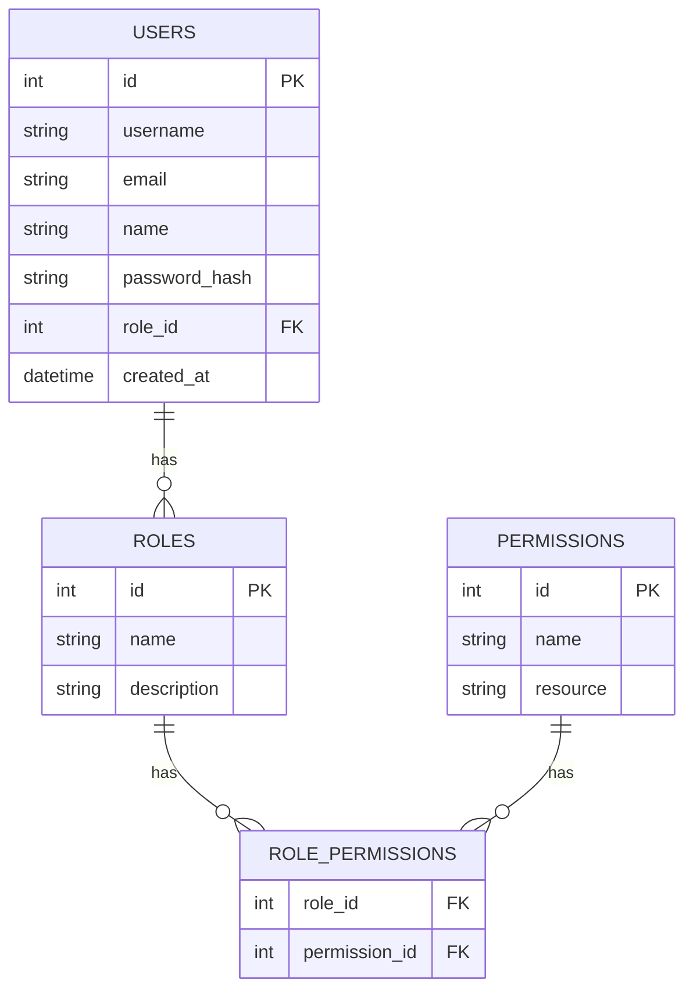
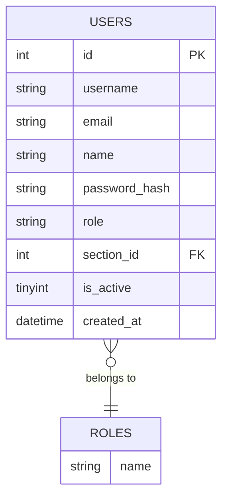

# ERD: User, Role, and Permission

## Entity-Relationship Diagram (Mermaid)

Copy the code below into [Mermaid Live Editor](https://mermaid.live) to view or export as image.

## Simplified (AJES-style: role as column)

If roles are stored as a column on Users (like in AJES):

## Relationship summary

| From   | To               | Relationship | Description                    |
|--------|------------------|--------------|--------------------------------|
| Users  | Roles           | Many-to-One  | Many users have one role       |
| Roles  | Permissions     | Many-to-Many | Roles have many permissions    |
|        | (via role_permissions) |            | Permissions belong to many roles |
