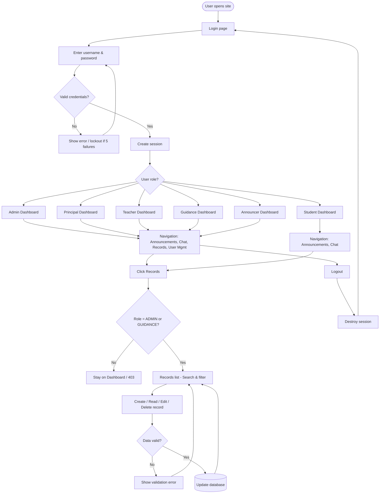

# Laboratory Exercise 3: System Development — Login, Dashboard, and Records Module

**AJES Crier** — Ano Jay Elementary School Announcement System  
**Lab focus:** Login module, Dashboard module, Records module, integration, and documentation.

---

## 1. Explain the importance of secure authentication in system development

**Secure authentication** is the gate that protects the system and its data. Its importance includes:

- **Access control:** Only identified users (students, teachers, admin, etc.) can use the system. Without it, anyone could view or change sensitive information.
- **Accountability:** Logins tie actions to a specific user (e.g. who created a record, who sent an announcement), which is required for audits and discipline.
- **Data protection:** In a school system, records and announcements are sensitive. Authentication ensures that only authorized roles (e.g. Guidance, Admin) can see or edit records.
- **Preventing abuse:** Measures such as password hashing, CSRF tokens, and lockout after failed attempts reduce the risk of stolen credentials and brute-force attacks.
- **Compliance and trust:** Schools must protect student data. Secure login (and related practices like password reset and session handling) supports compliance and builds trust with parents and staff.

In AJES we use **session-based authentication**: the user logs in with username and password; credentials are checked against the database (with hashed passwords); on success a session is created and the user is redirected to their role-based dashboard. Forgot-password and reset-password flows allow recovery without weakening security (e.g. time-limited tokens).

---

## 2. Discuss how a dashboard enhances user experience and system efficiency

A **dashboard** improves both **user experience (UX)** and **efficiency** in these ways:

- **Single entry point:** After login, the user lands on one screen that shows what matters for their role (e.g. recent announcements for a teacher, records summary for guidance), instead of hunting through menus.
- **Role-based content:** Different roles (Admin, Principal, Teacher, Student, Guidance, Announcer) see different KPIs and links. This reduces clutter and focuses each user on their tasks, which speeds up daily use.
- **Faster navigation:** The sidebar gives direct links to Announcements, Chat, Records, and User Management (where allowed). Users reach features in one or two clicks instead of memorizing URLs.
- **Visual overview:** Cards and short lists (e.g. “Recent announcements”, “Updates”) give a quick snapshot of recent activity so users can decide what to open, improving decision-making and reducing unnecessary clicks.
- **Consistency and responsiveness:** A single layout and green theme used across dashboards and the Records module make the system feel coherent; responsive layout supports use on different devices (e.g. mobile for students, desktop for staff).

Together, this reduces the time to complete common tasks and lowers the chance of errors, making the system more efficient and easier to adopt in a school setting.

---

## 3. Flowchart: Login, Dashboard, and Records module interaction

The diagram below shows how the **Login**, **Dashboard**, and **Records** modules interact in AJES.

**Summary flow:**

1. **Login:** User enters credentials → validated against DB (hashed password) → session created → redirect by role to the correct dashboard.
2. **Dashboard:** Each role sees their own dashboard and sidebar; only **Admin** and **Guidance** have access to the Records link.
3. **Records:** From the dashboard, Admin/Guidance open Records → list with **search** (type/details) and **filter** (type) → **CRUD** (Create, Read, Edit, Delete) with validation and CSRF → changes stored in the database.
4. **Logout:** Destroys the session and returns the user to the login page.

**Flowchart (text version, for redrawing in Word/draw.io):**

1. Start → Login page  
2. Login page → User enters username & password  
3. Validate credentials (DB, password hash)  
4. If invalid → Show error (or lockout after 5) → back to step 2  
5. If valid → Create session → Check user role  
6. Redirect to role dashboard (Admin / Principal / Teacher / Guidance / Announcer / Student)  
7. Dashboard → Navigation (Announcements, Chat, Records for allowed roles, User Mgmt for Admin)  
8. If user clicks Records → If role is Admin or Guidance → Records list (search & filter) → CRUD (Create/Read/Edit/Delete) → Validate input → If valid: update DB; if invalid: show error  
9. If role is not Admin/Guidance → No access to Records (stay on dashboard / 403)  
10. Logout → Destroy session → Back to Login page  

---

## 4. Lab 3 task checklist (activity requirements vs implementation)

| Lab requirement | Implementation in AJES |
|-----------------|-------------------------|
| **Login: session-based or token-based authentication** | Session-based: session created on login, stores user_id, name, role. |
| **Validate user credentials against the database** | `Auth::login()` checks username via `UserModel::findByLogin()`, verifies password with `password_verify()` against stored hash. |
| **Login error handling and password recovery** | Error messages for empty credentials, invalid credentials, lockout after 5 failures; Forgot Password + Reset Password (email + time-limited token). |
| **Dashboard: display relevant user data and system analytics** | Per-role KPIs and recent activity (e.g. announcements, updates, stats) on each dashboard. |
| **Navigation and user-friendly UI** | Sidebar with icons, topbar with user name and role badge, links to Announcements, Chat, Records, User Management (by role). |
| **Dashboard responsiveness** | Responsive grid and media queries in `template.php` (e.g. KPI row and dashboard grid stack on small screens). |
| **Role-based access to dashboard functionalities** | Routes use `auth` and `role` filters; sidebar menu items vary by role (e.g. Records only for ADMIN, GUIDANCE). |
| **Records: structured database schema** | Table `records` (id, student_id, type, details, created_by, timestamps, soft deletes) in migration `CreateCoreTables`. |
| **Records: CRUD** | Create (store), Read (index + edit view), Update (update), Delete (delete); all with role restriction. |
| **Records: search and filter** | Search by keyword (type or details); filter by type (dropdown); form submits to `records` with `q` and `type`. |
| **Records: data validation and security** | Required fields; max length (type 50, details 10,000); CSRF on forms; output escaped with `esc()`; access only for GUIDANCE and ADMIN. |
| **Integrate: seamless user flow login → dashboard → records** | Login redirects to role dashboard; Records pages use same layout/template as dashboards; sidebar links to Records for allowed roles. |
| **README with setup instructions and module descriptions** | README.md includes AJES quick setup (env, DB, migrate, seed) and module descriptions (Login, Dashboard, Records); Lab 3 doc linked. |
| **System workflow diagram** | Mermaid flowchart in Section 3; text version for redrawing in Word/draw.io. |

---

## 6. Output / Results

| Deliverable | Status | Description |
|------------|--------|-------------|
| **Login module** | Done | Session-based login; validation; error messages; account lockout after 5 failed attempts; forgot password and reset password (email + token). |
| **Dashboard module** | Done | Role-based dashboards (Admin, Principal, Teacher, Guidance, Announcer, Student); sidebar navigation; green theme; responsive layout; KPIs and recent activity per role. |
| **Records module** | Done | CRUD (Create, Read, Update, Delete); search by keyword (type/details); filter by type; pagination; data validation; CSRF; restricted to GUIDANCE and ADMIN. |
| **Integration** | Done | Login → redirect to role dashboard; dashboard sidebar links to Records (for allowed roles); Records pages use the same layout and styling. |
| **Version control** | Repo | Project maintained in GitHub/GitLab with commits for login, dashboard, records, and UI updates. |
| **Documentation** | Done | README (setup, modules); this Lab 3 document (answers, flowchart, output, conclusion). |

**How to test:**

1. **Login:** Open `/` or `/auth/login` → log in as `admin` / `guidance` (password e.g. `123123`) → should land on the correct dashboard.
2. **Dashboard:** Check that sidebar shows “Records” for Admin and Guidance; open Dashboard Home and other links.
3. **Records:** As Admin or Guidance, open “Records” → use Search and Type filter → Create a new record → Edit it → Delete (or leave as is).
4. **Forgot password:** Open “Forgot Password?” → enter email → send reset link (requires mail config for real email).

---

## 7. Conclusion

Laboratory Exercise 3 required implementing and integrating three core modules: **Login**, **Dashboard**, and **Records**. In AJES we achieved:

- A **secure login** flow with validation, hashed passwords, lockout, and password recovery, so only authorized users access the system.
- **Role-based dashboards** that improve UX and efficiency by showing relevant information and navigation per role (Admin, Principal, Teacher, Guidance, Announcer, Student).
- A **Records** module with full CRUD, search, filter by type, and access limited to Guidance and Admin, integrated into the same layout and navigation as the dashboards.

Integrating these modules (login → dashboard → records) and documenting the flow (including the flowchart above) clarifies how authentication, authorization, and data management work together. Maintaining the project in version control and documenting setup and module roles supports teamwork and future extensions (e.g. announcements, chat, and approval workflows).

---

*End of Lab 3 documentation.*
